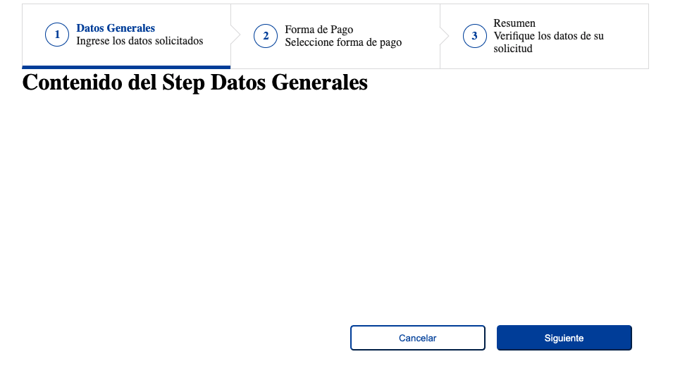

# React Components

Generic components for react

## Getting Started

```
yarn
ng start or yarn storybook
```

### Components

* Wizard

**Outputs**

```
Stepper ( onFinish, onCancel )
Step ( onValidateNext, onBack )
```

**Inputs**

```
Stepper [ isFinishDisabled, finishButtonText ]
Step [ title, subTitle, error, isDirty ]
```

```

<div className="border-box h-100 p-4 p-sm-none">
  <Stepper
    finishButtonText="Pagar"
    onFinish={onCreateNewReport}
    isFinishDisabled={!finished && !acceptTermAndConditions}
    onCancel={onCancel}>
    <Step
      title="Datos Generales"
      subTitle="Ingrese los datos solicitados"
      error={ui.generalDataStepErrors.length > 0}
      isDirty={ui.generalDataStepIsDirty}
      onValidateNext={validateGeneralData}>
      <GeneralData
        initialValues={data.generalData}
        userInfo={userInfo}/>
    </Step>
    <Step 
        title="Forma de Pago"
        subTitle="Seleccione su forma de pago"
        error={isNullOrUndefined(data.paymentType)}
        errorMessage={paymentErrorMessages}
        isDirty={ui.paymentStepIsDirty}
        onValidateNext={validateSelectedPayment}
        onBack={onBackPaymentSelected}>
      <SelectPayment
        paymentType={data.paymentType}
        billInfo={data.billInfo}
        onEditBillInfo={updateBillInfo}
        onRemoveBillInfo={deleteBillInfo}
        onEditPaymentType={updatePaymentType}/>
    </Step>
    <Step title="Resumen" subTitle="Verifique los datos de su solicitud">
      <Resume />
    </Step>
  </Stepper>
</div>
```



## Version
```0.1```

## Authors

* **Javier González Rodríguez** - [javico2609](https://github.com/javico2609)

## License

This project is licensed under the MIT License - see the [LICENSE.md](LICENSE.md) file for details